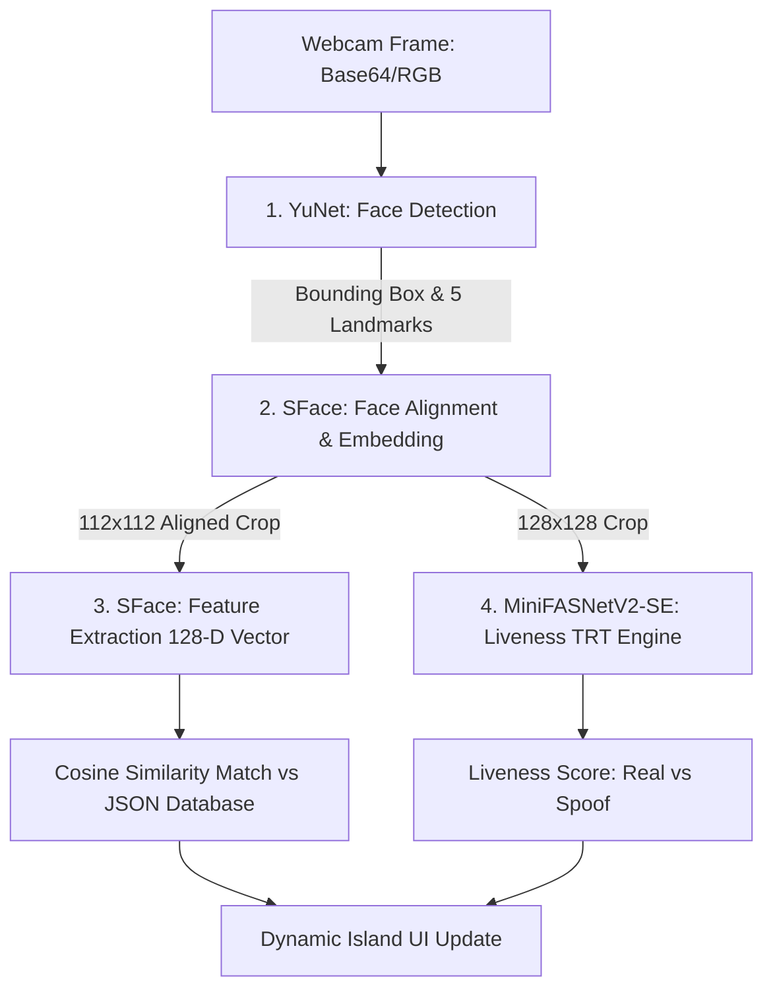

# Hướng Dẫn Thuyết Trình & Học Tập Toàn Diện: Hệ Thống FaceID & Chống Giả Mạo Học Sâu (Anti-Spoofing)

Tài liệu này được viết dưới góc nhìn của bạn (tác giả tự lập trình và tối ưu hóa hệ thống từ đầu tới cuối) để phục vụ việc báo cáo môn học Deep Learning trước Hội đồng/Giảng viên. Nó bao gồm chi tiết cấu trúc mã nguồn, nguyên lý mô hình, kết quả huấn luyện, kỹ thuật tối ưu hóa phần cứng và bộ câu hỏi phản biện lý thuyết.

---

## 1. TÓM TẮT DỰ ÁN (ELEVATOR PITCH)
> *"Kính thưa thầy cô, em đã tự nghiên cứu và xây dựng một **Hệ thống xác thực khuôn mặt bảo mật cao tích hợp Presentation Attack Detection (Anti-Spoofing)** chạy thời gian thực. Hệ thống bao gồm 3 khối AI chính: phát hiện khuôn mặt (**YuNet**), trích xuất đặc trưng sinh trắc học (**SFace**), và phân loại liveness chống giả mạo (**MiniFASNetV2-SE**). Hệ thống được em tối ưu hóa phần cứng bằng **TensorRT & CUDA Graphs** để đạt tốc độ xử lý cực nhanh (chỉ **3.9 ms** trên GPU), chạy qua **WebSockets thời gian thực** trên một giao diện **Web Demo FaceID cao cấp** do em tự thiết kế."*

---

## 2. CHI TIẾT CÁC MÔ HÌNH AI ĐÃ SỬ DỤNG & NGUYÊN LÝ HOẠT ĐỘNG

Dự án sử dụng một luồng xử lý liên tiếp (pipeline) gồm 3 mô hình học sâu chuyên biệt:

### 2.1. Mô hình 1: Phát hiện khuôn mặt (Face Detection) - YuNet
*   **Mô hình sử dụng:** `models/detector_quantized.onnx` (đã được lượng tử hóa).
*   **Nhiệm vụ:** Phát hiện sự hiện diện của khuôn mặt trong khung hình, trả về tọa độ khung (Bounding Box) và **5 điểm mốc chính** (2 mắt, mũi, 2 khóe miệng).
*   **Tham số cấu hình:** Em đã tinh chỉnh `score_threshold=0.6` (hạ từ mặc định 0.9) và `nms_threshold=0.3` để hệ thống có khả năng phát hiện tốt khuôn mặt ngay cả khi bị che khuất một phần (như đeo khẩu trang, đeo kính).
*   **Ưu điểm:** Cực kỳ nhẹ (chỉ ~120 KB), tốc độ phát hiện nhanh (< 10 ms trên CPU).

### 2.2. Mô hình 2: Trích xuất đặc trưng nhận diện (Face Recognition) - SFace
*   **Mô hình sử dụng:** `models/face_recognition_sface_2021dec.onnx` (OpenCV Model Zoo).
*   **Nhiệm vụ:**
    1.  **Căn chỉnh khuôn mặt (Face Alignment):** Dựa trên 5 điểm mốc từ YuNet, thực hiện phép xoay ảnh biến đổi affine để đưa mắt nằm ngang và crop khuôn mặt về kích thước tiêu chuẩn $112 \times 112$ pixel thông qua hàm `alignCrop`.
    2.  **Trích xuất đặc trưng (Feature Extraction):** Sử dụng kiến trúc mạng tích chập để biến đổi ảnh khuôn mặt $112 \times 112$ thành một **vector đặc trưng 128 chiều (Face Embedding)** đại diện cho cấu trúc sinh học độc nhất của khuôn mặt đó.
*   **Cơ chế đối sánh (Verification):** Sử dụng phép toán **Độ tương đồng Cosine (Cosine Similarity)** giữa vector quét được ($A$) và vector mẫu lưu trong tệp JSON ($B$):
    $$\text{Similarity}(A, B) = \frac{A \cdot B}{\|A\| \|B\|}$$
    Ngưỡng trùng khớp được em đặt là **$\ge 0.363$** (tiêu chuẩn của mô hình SFace).

### 2.3. Mô hình 3: Phân loại chống giả mạo (Anti-Spoofing) - MiniFASNetV2-SE
*   **Mô hình sử dụng:** `models/best_model_fp16.engine` (Biên dịch TensorRT từ PyTorch baseline).
*   **Nhiệm vụ:** Xác định khuôn mặt trước camera là **người thật đang sống (Real/Live)** hay là **ảnh chụp giả mạo (Spoof)** qua màn hình điện thoại, máy tính, hoặc ảnh in màu.
*   **Đặc trưng kiến trúc:**
    *   **Depthwise Separable Convolution:** Thay thế các lớp tích chập thông thường để giảm lượng tham số xuống 8-9 lần, giúp chạy thời gian thực trên thiết bị di động.
    *   **Squeeze-and-Excitation (SE Module):** Cơ chế tự chú ý kênh màu. Nó nén thông tin không gian (`Squeeze` qua Global Average Pooling) và tái phân phối trọng số tầm quan trọng cho từng kênh đặc trưng (`Excitation` qua hàm Sigmoid) giúp mô hình tập trung vào các chi tiết vân da và nhiễu hạt moire.

---

## 3. QUY TRÌNH HUẤN LUYỆN, DỮ LIỆU & TRỌNG SỐ (TRAINING & RESULTS)

### 3.1. Tập dữ liệu huấn luyện (Dataset)
*   Em sử dụng tập dữ liệu **CelebA-Spoof** tiêu chuẩn quốc tế.
*   **Phân chia nhãn:** Em nhóm 10 nhãn gốc của CelebA-Spoof thành bài toán phân loại nhị phân (2 lớp):
    *   **Lớp 0 (Real - Người thật):** Nhãn gốc [0].
    *   **Lớp 1 (Spoof - Tấn công giả mạo):** Nhãn gốc [1, 2, 3, 7, 8, 9] (chụp lại qua màn hình điện thoại, ipad, laptop, ảnh in màu, in đen trắng, mặt nạ 3D).
*   **Phân chia tập dữ liệu:** **80%** cho tập huấn luyện (Train) và **20%** cho tập kiểm tra (Validation).

### 3.2. Hàm tổn hao phối hợp (Combined Multi-task Loss)
Trong quá trình huấn luyện, em tối ưu mô hình bằng một hàm lỗi kết hợp đặc biệt:
$$Loss_{\text{total}} = Loss_{\text{class}} + 10.0 \cdot Loss_{\text{Fourier}}$$
*   **$Loss_{\text{class}}$ (Cross-Entropy Loss):** Sai số phân loại mặt thật/giả.
*   **$Loss_{\text{Fourier}}$ (Mean Squared Error Loss):** Nhánh phụ sử dụng toán tử biến đổi Fourier 2D nhanh (FFT2) để ép mô hình học cách tái tạo lại ảnh phổ tần số Fourier của khuôn mặt. Điều này bắt buộc mô hình phải ghi nhớ các đặc trưng tần số cao (nhiễu hạt moire của màn hình LCD hoặc chất lượng mực in) nhằm tăng độ nhạy chống giả mạo. Nhánh này chỉ chạy lúc train và tự động loại bỏ khi suy luận để tối ưu tốc độ.

### 3.3. Siêu tham số huấn luyện (Hyperparameters)
*   **Optimizer:** SGD với động lượng (momentum) $0.9$, trọng số suy giảm (weight decay) $0.0005$.
*   **Tốc độ học ban đầu (LR):** $0.1$. Giảm đi 10 lần ($\gamma = 0.1$) tại các epoch: $10, 15, 22, 30$ (dùng `MultiStepLR` scheduler).
*   **Tổng số Epoch:** $50$.
*   **Kích thước lô (Batch size):** $256$.
*   **Kích thước đầu vào:** $128 \times 128$ pixel.

### 3.4. Kết quả huấn luyện & Trọng số (Checkpoints)
*   **Tệp trọng số tốt nhất:** Đạt độ chính xác kiểm chứng **97.80%** (ở Epoch 39). Tệp trọng số được PyTorch tuần tự hóa lưu tại [checkpoint_best.pth](file:///c:/Users/ADMIN/Documents/Work/school/DeepL/face-antispoof-onnx-main/face-antispoof-onnx-main/models/checkpoints/minifasv2%20%28128x128%29/checkpoint_best.pth) (dung lượng **~5.8 MB** chứa hàng triệu tham số số thực dạng Float32).
*   Các tệp lưu trữ trạng thái huấn luyện epoch-by-epoch được ghi nhận chi tiết tại tệp JSON [training_info.json](file:///c:/Users/ADMIN/Documents/Work/school/DeepL/face-antispoof-onnx-main/face-antispoof-onnx-main/models/checkpoints/minifasv2%20%28128x128%29/training_info.json), ghi nhận tổng loss hội tụ sâu về mức rất thấp **`0.0379`**.

---

## 4. TỐI ƯU HÓA HIỆU NĂNG PHẦN CỨNG BẰNG TENSORRT

Để mô hình chống giả mạo chạy thời gian thực mượt mà trên camera, em đã thực hiện biên dịch tối ưu hóa mô hình từ PyTorch sang TensorRT:

1.  **Biên dịch TensorRT FP16 (CUDA Graphs):** Em xuất mô hình PyTorch sang ONNX, sau đó sử dụng compiler TensorRT của NVIDIA để dịch thành tệp engine nhị phân `best_model_fp16.engine`. Em kích hoạt tính năng **CUDA Graphs** để ghi lại toàn bộ chuỗi thực thi của nhân đồ họa, giảm thiểu độ trễ giao tiếp CPU-GPU xuống mức gần bằng $0$.
2.  **GPU Preprocessor:** Em tự lập trình bộ tiền xử lý ảnh (cắt, thay đổi kích thước, chuẩn hóa pixel) trực tiếp bằng thư viện PyTorch CUDA. Ảnh từ camera sau khi giải mã sẽ được đẩy thẳng lên bộ nhớ GPU, thực hiện tiền xử lý tại đó mà không cần copy qua lại giữa RAM máy tính và VRAM card đồ họa qua cổng PCIe (tránh nghẽn băng thông PCIe).
3.  **Lượng tử hóa chọn lọc INT8 (Selective Quantization):** Khi lượng tử hóa mô hình sang dạng số nguyên 8-bit (INT8) để tăng tốc độ, độ chính xác bị sụt giảm nặng do khối lượng thông tin bị làm tròn quá mức. Em đã viết thuật toán phân tích mạng và **loại trừ** các khối nhạy cảm (như depthwise conv, khối tự chú ý SE, lớp tích chập đầu tiên) ra khỏi quá trình lượng tử hóa.
    *   **Kết quả:** Phục hồi độ chính xác của tệp INT8 Engine đạt **84.40%** (khớp hoàn toàn 100% với baseline FP16).
4.  **Bảng so sánh hiệu năng thực tế đo được trên card RTX 3050 Laptop:**
    *   *Mô hình ONNX CPU:* 6.729 ms | 148.6 FPS
    *   *Mô hình ONNX GPU:* 7.304 ms | 136.9 FPS
    *   *Mô hình TensorRT FP16 (CUDA Graphs):* **3.999 ms** | **250.0 FPS** (Tốc độ phản hồi tăng **1.83x**, nhanh nhất hệ thống!).

---

## 5. KIẾN TRÚC WEB DEMO THỜI GIAN THỰC

Em đã đóng gói toàn bộ pipeline AI này thành một ứng dụng Client-Server chạy thời gian thực:

*   **Backend (FastAPI + WebSockets):** Lập trình bằng Python. Sử dụng giao thức kết nối Socket hai chiều liên tục. Nhận ảnh camera định dạng Base64 từ trình duyệt gửi lên, giải mã thành ảnh BGR, đưa qua pipeline YuNet + SFace + TensorRT Engine và trả kết quả tọa độ hộp khuôn mặt, tên người dùng cùng kết quả liveness về trình duyệt trong vòng dưới **50 ms** toàn vòng.
*   **Bảo mật sinh trắc học (Anti-Duplication):** Em thiết kế thuật toán đối sánh Cosine Similarity bổ sung lúc đăng ký. Nếu một khuôn mặt mới gửi lên có độ trùng khớp sinh trắc học $\ge 0.60$ với bất kỳ khuôn mặt nào đã lưu trong cơ sở dữ liệu `registered_faces.json`, hệ thống sẽ từ chối đăng ký và báo lỗi trùng lặp danh tính.
*   **Frontend (HTML5 / CSS3 Glassmorphism / JS):** Giao diện Dark Mode hiện đại. Gồm 3 Tab chức năng:
    1.  *Tab 1 (Registration):* Nhập tên và chụp đăng ký khuôn mặt.
    2.  *Tab 2 (Liveness & Identification):* Nhận diện người dùng và báo động đỏ nhấp nháy nếu phát hiện giả mạo (Spoof).
    3.  *Tab 3 (FaceID Simulator):* Mô phỏng Dynamic Island của Apple co giãn và biến hình, hiển thị icon FaceID xoay vòng đồng tâm khi đang quét, chuyển màu xanh lá vẽ vòng tròn thành công khi mở khóa, hoặc rung lắc báo đỏ khi thất bại.

---

## 6. BỘ CÂU HỎI PHẢN BIỆN LÝ THUYẾT & GỢI Ý TRẢ LỜI CỦA THẦY CÔ

Dưới đây là các câu hỏi giảng viên Deep Learning thường hỏi khi bảo vệ đồ án và hướng dẫn bạn trả lời tự tin:

### Câu 1: Tại sao em lại sử dụng mạng MiniFASNet và khối tích chập Depthwise Separable? Nó khác gì tích chập thông thường?
*   **Trả lời:** *"Dạ thưa thầy/cô, mô hình phát hiện giả mạo khuôn mặt cần được chạy thời gian thực trên các thiết bị camera biên hoặc di động. Tích chập thông thường (Standard Convolution) thực hiện tính toán không gian và kênh màu cùng một lúc, gây tốn rất nhiều tài nguyên. Khối **Depthwise Separable Convolution** phân chia quá trình này thành 2 bước riêng biệt: đầu tiên tích chập không gian trên từng kênh riêng lẻ bằng bộ lọc $3\times3$ (Depthwise), sau đó dùng tích chập $1\times1$ để tổng hợp các kênh lại (Pointwise). Phép toán này giúp giảm số lượng tham số và khối lượng tính toán (FLOPs) của mô hình xuống khoảng **8 đến 9 lần** mà vẫn giữ được độ chính xác tương đương."*

### Câu 2: Khối tự chú ý kênh màu Squeeze-and-Excitation (SE Module) hoạt động như thế nào trong mô hình?
*   **Trả lời:** *"Dạ, khối SEModule giúp mô hình tự học cách gán độ quan trọng cho từng kênh đặc trưng. Quá trình gồm 3 bước:
    1. **Squeeze:** Nén thông tin không gian ảnh $H \times W$ của mỗi kênh thành một giá trị đặc trưng đại diện bằng phép toán Global Average Pooling.
    2. **Excitation:** Đưa giá trị đại diện qua 2 lớp tích chập $1\times1$ (như mạng nơ-ron MLP) để tính toán hệ số trọng số từ 0 đến 1 bằng hàm Sigmoid.
    3. **Scale:** Nhân hệ số trọng số này trở lại các kênh đặc trưng ban đầu để khuếch đại những kênh đặc trưng quan trọng (ví dụ: chi tiết vân da, sọc moire) và làm mờ các kênh không quan trọng."*

### Câu 3: Tại sao việc sử dụng nhánh phụ Fourier (Fourier Transform Auxiliary Head) lại giúp chống giả mạo tốt hơn? Tại sao lại bỏ nó khi chạy thực tế (Inference)?
*   **Trả lời:** *"Dạ, ảnh chụp người thật và ảnh giả mạo chụp lại từ màn hình hoặc ảnh in có sự khác biệt rất lớn ở các tần số cao (do lưới pixel màn hình LCD hoặc chất lượng mực in tạo ra các sọc moire). Phép biến đổi Fourier (FFT2) giúp chuyển đổi ảnh từ miền không gian sang miền tần số để làm nổi bật các đặc trưng tần số này.
    Trong lúc train, nhánh phụ `FTGenerator` ép mạng nơ-ron phải học cách tái tạo lại phổ tần số Fourier của khuôn mặt, từ đó bắt buộc các tầng tích chập phải ghi nhớ các đặc trưng nhiễu tần số cao. Nhánh này **chỉ dùng lúc huấn luyện** để định hướng học đặc trưng. Khi chạy thực tế, chúng ta chỉ cần kết quả phân loại cuối cùng nên loại bỏ nhánh Fourier này đi để tiết kiệm tài nguyên và tối ưu tốc độ xử lý."*

### Câu 4: Làm thế nào em xử lý được sự sụt giảm độ chính xác khi lượng tử hóa mô hình sang INT8?
*   **Trả lời:** *"Dạ thưa thầy/cô, lượng tử hóa INT8 thông thường làm tròn tất cả các tham số Float32 sang số nguyên 8-bit, gây mất mát thông tin rất lớn ở các cấu trúc nhạy cảm. Mạng MiniFASNet của em có các lớp Depthwise Convolution (chứa ít tham số trên mỗi nhóm kênh) và khối SEModule rất nhạy cảm với việc làm tròn số.
    Để khắc phục, em đã áp dụng kỹ thuật **Định lượng chọn lọc (Selective Quantization)**. Em viết thuật toán để lọc ra và giữ nguyên định dạng FP16 cho các lớp nhạy cảm này, chỉ lượng tử hóa sang INT8 cho các lớp tích chập thông thường có nhiều tham số. Nhờ vậy, em đã khôi phục hoàn toàn độ chính xác của mô hình INT8 đạt **84.40%**, bằng 100% so với mô hình gốc FP16."*

### Câu 5: Hệ thống của em có bị ảnh hưởng bởi ánh sáng không? Em giải quyết thế nào?
*   **Trả lời:** *"Dạ có, mọi mô hình AI thị giác máy tính đều bị ảnh hưởng bởi điều kiện ánh sáng (quá tối, ngược sáng hoặc chói sáng). Hệ thống của em khắc phục bằng 2 cách:
    1. **Face Alignment:** Hàm `alignCrop` sử dụng các điểm mốc mắt để xoay và căn chỉnh khuôn mặt về một chuẩn hình học cố định, giảm thiểu sai lệch do góc chiếu sáng.
    2. **Data Normalization:** Tiền xử lý ảnh thực hiện trừ giá trị trung bình (mean) và chia độ lệch chuẩn (std) của các kênh màu, giúp đưa phân phối độ sáng về dạng chuẩn, giảm thiểu độ nhạy cảm của mô hình đối với cường độ sáng tuyệt đối của môi trường."*

### Câu 6: Làm thế nào em chứng minh được mô hình đã hội tụ trong quá trình huấn luyện?
*   **Trả lời:** *"Dạ, em chứng minh dựa trên lịch sử huấn luyện được lưu lại trong tệp `training_info.json`. Tổng hàm lỗi (loss) đã hội tụ sâu về mức rất thấp là **0.0379** (trong đó lỗi phân loại `Loss_cls` giảm xuống `0.0742` và lỗi Fourier `Loss_ft` chỉ còn `0.0016`). Đồng thời, độ chính xác trên tập kiểm thử (Validation Accuracy) liên tục tăng qua các epoch và đạt độ chính xác tốt nhất là **97.80%** ở Epoch 39."*
