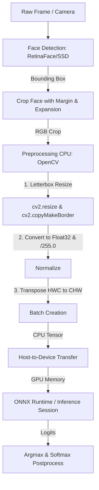

# Hệ Thống Kiến Trúc Baseline & Cấu Trúc Toán Học (MiniFASNetV2-SE)

Tài liệu này mô tả chi tiết kiến trúc mạng **MiniFASNetV2-SE** cùng với phương pháp học bổ trợ Fourier Transform (FT) và quy trình dữ liệu trong dự án Face Antispoofing.

---

## 1. Cấu Trúc Toán Học Của MiniFASNetV2-SE

MiniFASNetV2-SE là một kiến trúc Lightweight CNN được thiết kế đặc thù cho bài toán Face Anti-Spoofing (Chống giả mạo khuôn mặt). Nó kế thừa từ MobileNet nhưng được tối ưu hóa sâu sắc bằng cách kết hợp **Depthwise Separable Convolutions** và **Squeeze-and-Excitation (SE) Blocks** tại các ranh giới Stage.

### 1.1. Depthwise Separable Convolution
Khối Conv thông thường biến đổi input $X \in \mathbb{R}^{H \times W \times C_{in}}$ sang output $Y \in \mathbb{R}^{H' \times W' \times C_{out}}$ bằng một kernel $K \in \mathbb{R}^{D_k \times D_k \times C_{in} \times C_{out}}$. Chi phí tính toán là:
$$\text{Cost}_{\text{standard}} = H' \cdot W' \cdot C_{in} \cdot C_{out} \cdot D_k^2$$

Khối Depthwise Separable Conv phân tách quá trình này thành hai bước:
1. **Depthwise Convolution**: Áp dụng bộ lọc riêng biệt cho từng kênh:
   $$\text{Cost}_{\text{depthwise}} = H' \cdot W' \cdot C_{in} \cdot D_k^2$$
2. **Pointwise Convolution (1x1 Conv)**: Tổ hợp tuyến tính các kênh để tạo feature map mới:
   $$\text{Cost}_{\text{pointwise}} = H' \cdot W' \cdot C_{in} \cdot C_{out}$$

Tổng chi phí giảm đi đáng kể:
$$\frac{\text{Cost}_{\text{sep}}}{\text{Cost}_{\text{standard}}} = \frac{H' \cdot W' \cdot C_{in} \cdot D_k^2 + H' \cdot W' \cdot C_{in} \cdot C_{out}}{H' \cdot W' \cdot C_{in} \cdot C_{out} \cdot D_k^2} = \frac{1}{C_{out}} + \frac{1}{D_k^2}$$
Với kernel $3 \times 3$, chi phí tính toán giảm khoảng 8 đến 9 lần.

### 1.2. Khối Squeeze-and-Excitation (SE Block)
Khối SE giúp mạng điều chỉnh trọng số của các kênh một cách linh hoạt dựa trên bối cảnh thông tin toàn cục:

1. **Squeeze (Khai thác thông tin toàn cục)**: Thực hiện Global Average Pooling trên feature map $U \in \mathbb{R}^{H \times W \times C}$ để tạo vector đặc trưng kênh $z \in \mathbb{R}^C$:
   $$z_c = F_{sq}(u_c) = \frac{1}{H \times W} \sum_{i=1}^H \sum_{j=1}^W u_c(i, j)$$
2. **Excitation (Kích hoạt thích ứng)**: Đi qua 2 lớp FC kết hợp hàm phi tuyến để học mối quan hệ phi tuyến giữa các kênh:
   $$s = F_{ex}(z, W) = \sigma(g(z, W)) = \sigma(W_2 \cdot \delta(W_1 \cdot z))$$
   Trong đó:
   - $W_1 \in \mathbb{R}^{\frac{C}{r} \times C}$ (giảm số chiều với hệ số reduction $r=4$ hoặc $8$).
   - $\delta$ là hàm kích hoạt ReLU.
   - $W_2 \in \mathbb{R}^{C \times \frac{C}{r}}$ (khôi phục số chiều).
   - $\sigma$ là hàm Sigmoid.
3. **Scale**: Trọng số hóa các kênh của feature map gốc bằng vector kích hoạt $s$:
   $$\tilde{x}_c = F_{scale}(u_c, s_c) = s_c \cdot u_c$$

---

## 2. Nhánh Phụ Trợ Biến Đổi Fourier (Fourier Transform Branch)

Một trong các vấn đề lớn nhất của Face Anti-Spoofing là mạng rất dễ bị quá khớp (overfit) vào đặc trưng ID khuôn mặt thay vì học được các vân nhiễu cấu trúc (Screen moiré, printer ink texture, reflection). Để ép mô hình tập trung vào tần số vân bề mặt, một nhánh Generator bổ trợ được tích hợp trong quá trình huấn luyện để tái tạo phổ Fourier.

### 2.1. Biến Đổi Fourier Hai Chiều (2D Discrete Fourier Transform)
Ảnh khuôn mặt thực (Real) và ảnh giả mạo qua màn hình/giấy in (Spoof) có sự khác biệt rõ rệt về phân bố năng lượng tần số. Phổ Fourier của ảnh $f(x, y)$ kích thước $M \times N$ được tính bằng:
$$F(u, v) = \sum_{x=0}^{M-1} \sum_{y=0}^{N-1} f(x, y) e^{-i 2\pi \left(\frac{ux}{M} + \frac{vy}{N}\right)}$$

Bản đồ biên độ Fourier thu được:
$$|F(u, v)| = \sqrt{\text{Real}(F(u, v))^2 + \text{Imag}(F(u, v))^2}$$

### 2.2. Nhánh FTGenerator và Hàm Loss Bổ Trợ
Trong quá trình huấn luyện, đầu ra của Stage 2 (kích thước $16 \times 16 \times 128$) được đưa qua khối `FTGenerator` gồm 3 lớp tích chập để dự đoán bản đồ phổ tần số thực tế $I_{FT}$ của ảnh đầu vào.

Mô hình được tối ưu bằng hàm loss kết hợp:
$$\mathcal{L}_{\text{total}} = \alpha \cdot \mathcal{L}_{\text{cls}} + (1 - \alpha) \cdot \mathcal{L}_{\text{FT}}$$

Trong đó:
- $\alpha = 0.5$
- $\mathcal{L}_{\text{cls}}$: Cross Entropy Loss đối với đầu ra phân loại lớp (Real vs Spoof).
- $\mathcal{L}_{\text{FT}}$: Mean Squared Error (MSE) Loss giữa phổ Fourier dự đoán bởi Generator và phổ Fourier thực tế được tính toán trực tiếp từ ảnh đầu vào:
  $$\mathcal{L}_{\text{FT}} = \frac{1}{H \times W} \sum_{x=1}^H \sum_{y=1}^W (I_{\text{FT\_pred}}(x, y) - I_{\text{FT\_gt}}(x, y))^2$$

*Lưu ý:* Nhánh `FTGenerator` này chỉ tồn tại lúc Train nhằm hướng dẫn backbone học đặc trưng tần số. Khi Inference, nhánh này hoàn toàn bị lược bỏ để giảm thiểu khối lượng tính toán.

---

## 3. Quy Trình Dữ Liệu Hiện Tại (Baseline Pipeline)

### Phân tích Điểm Nghẽn (Bottleneck Analysis)
- **CPU Bound Preprocessing:** Hàm `preprocess` sử dụng `cv2.resize` (với các thuật toán nội suy nặng như `INTER_LANCZOS4`), tiếp theo là `cv2.copyMakeBorder` để tạo viền bù gương phản chiếu (`BORDER_REFLECT_101`), sau đó thực hiện lặp qua batch trên CPU. Điều này tiêu hao lượng lớn tài nguyên CPU và tăng độ trễ tổng thể (Latency).
- **H2D Transfer Latency:** Dữ liệu sau khi xử lý trên CPU được đẩy lên GPU dưới dạng tensor dạng float32 tuần tự cho từng frame hoặc batch nhỏ. Việc truyền dữ liệu liên tục này gây tắc nghẽn băng thông PCIe.
