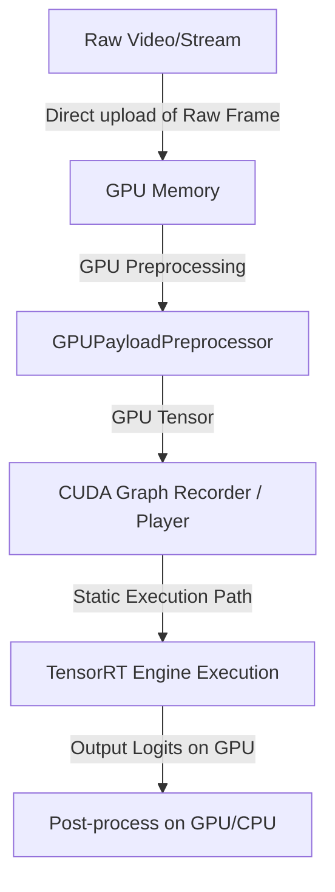

# Cẩm Nang Tối Ưu Hóa Phần Cứng Cực Hạn & Triển Khai Edge AI (June 2026)

Tài liệu này tổng hợp toàn bộ lý thuyết nền tảng, thiết kế hệ thống tối ưu, các thay đổi mã nguồn chi tiết và hướng dẫn sử dụng thực tế.

---

## 1. Lý Thuyết Tối Ưu Hóa Phần Cứng (Hardware-Aware Optimization Theory)

### 1.1. Khử Bottleneck Tiền Xử Lý: CPU vs GPU Bound
Trong các hệ thống thị giác máy tính truyền thống, mô hình AI chạy trên GPU rất nhanh (chỉ mất vài ms), nhưng tổng thời gian xử lý (E2E Latency) vẫn cao và FPS bị sụt giảm đáng kể. Nguyên nhân chính là **CPU-GPU Heterogeneous Bottleneck**.

- **OpenCV/Numpy CPU Preprocessing:** Các thao tác đọc, crop, resize (đặc biệt là nội suy Lanczos/Bicubic), padding và chuyển đổi kiểu dữ liệu (Normalize, Transpose) chạy tuần tự trên CPU. CPU phải hoạt động liên tục làm tăng nhiệt độ, giảm hiệu suất và là nút cổ chai khiến GPU phải ở trạng thái chờ dữ liệu (GPU Underutilization).
- **GPU Preprocessing (Zero-Copy & Direct GPU Pipeline):** Bằng cách giữ nguyên dữ liệu trên GPU ngay từ khâu đầu tiên hoặc chuyển dữ liệu thô (Raw uint8 frame) lên GPU duy nhất một lần, toàn bộ các phép toán xử lý ảnh tiếp theo được thực hiện song song bằng hàng ngàn nhân CUDA (thông qua PyTorch CUDA/TorchVision hoặc Triton Kernels). Điều này giúp:
  1. Loại bỏ các lệnh gọi CPU ghi đè bộ nhớ liên tục.
  2. Tận dụng băng thông bộ nhớ VRAM cực cao của GPU để thực hiện Resize và Pad.
  3. Giảm kích thước dữ liệu truyền từ Host sang Device (H2D) nhờ truyền ảnh nén/ảnh thô thay vì tensor float32 đã tiền xử lý.

### 1.2. Nút Cổ Chai Kernel Launch Overhead & CUDA Graphs
Khi thực thi một mô hình Deep Learning trên GPU, CPU không trực tiếp chạy tính toán mà gửi các lệnh thực thi (Kernel Launches) qua driver CUDA đến GPU. 

Với các mô hình siêu nhỏ như MiniFASNet (1.8M tham số), thời gian GPU chạy một lớp (kernel) vô cùng nhỏ (vài micro-giây). Tuy nhiên, CPU mất từ 3-10 micro-giây để kích hoạt (launch) mỗi kernel đó. Do mô hình gồm hàng trăm lớp nối tiếp nhau, tổng thời gian CPU dành để launch kernel (CPU Launch Overhead) lớn hơn rất nhiều so với thời gian tính toán thực tế trên GPU.

**CUDA Graphs** giải quyết triệt để vấn đề này:
- **Cơ chế Capture:** Ở lượt chạy đầu tiên (Warm-up), driver ghi lại toàn bộ chuỗi các kernel thực thi, luồng dữ liệu, địa chỉ bộ nhớ và quan hệ phụ thuộc thành một Đồ thị tĩnh (Static Graph).
- **Cơ chế Exec:** Ở các lượt chạy tiếp theo, CPU chỉ cần phát ra một lệnh thực thi đồ thị duy nhất (`cudaGraphLaunch`). Toàn bộ hàng trăm kernel sẽ tự động chạy liên tiếp trên GPU mà không có bất kỳ giao tiếp trung gian nào với CPU. Lợi ích thu được là giảm thiểu Latency xuống mức cực hạn và giải phóng hoàn toàn CPU.

### 1.3. Lượng Tử Hóa Lớp Nhạy Cảm (Explicit Quantization Q/DQ trong TensorRT 11)
TensorRT 11.0+ đã lược bỏ các API lượng tử hóa ngầm định (Implicit Quantization) như `IInt8Calibrator`. Thay vào đó, nó chuyển hoàn toàn sang **Lượng tử hóa tường minh (Explicit Quantization)** sử dụng các node Q/DQ (QuantizeLinear/DequantizeLinear) tích hợp trực tiếp trong đồ thị ONNX.

1. **Static Q/DQ Quantization:** Sử dụng ONNX Runtime Quantization để chèn các node Q/DQ vào đồ thị dựa trên Calibration Dataset. Biến đổi này xác định chính xác vị trí và hệ số scale để đưa dữ liệu về INT8 một cách tường minh.
2. **Symmetric Quantization:** Nhằm tương thích tốt nhất với phần cứng Tensor Cores trên GPU, việc lượng tử hóa cả activation và weight bắt buộc phải là đối xứng (Symmetric, zero-point = 0). Chúng ta thiết lập `extra_options={"ActivationSymmetric": True, "WeightSymmetric": True, "QuantizeBias": False}` để loại bỏ offset và giữ bias ở dạng FP32/FP16 (tránh lỗi định dạng Int32 bias trong TensorRT parser).
3. **Mixed-Precision Protection:** Bằng cách thiết lập precision constraints trong TensorRT config, ta bảo vệ các lớp nhạy cảm như `logits`, `se_module`, `sigmoid` và `bn` chạy ở FP16, trong khi các convolutional layer xương sống chạy ở INT8 để tối đa hóa hiệu năng.

---

## 2. Thiết Kế Hệ System & Các Thay Đổi Code (System Architecture & Code Modifications)

Dưới đây là sơ đồ kiến trúc luồng dữ liệu tối ưu hóa cực hạn được thiết kế:



### 2.1. Module Tiền Xử Lý Trên GPU (`src/inference/preprocess_cuda.py`)
Class `GPUPayloadPreprocessor` thực hiện:
- `crop_gpu()`: Thực hiện crop khuôn mặt trên GPU tensor. Bổ sung hàm `safe_pad_reflect()` tự động kiểm tra kích thước padding; nếu padding vượt quá kích thước tensor (do mặt quá sát rìa ảnh), hệ thống tự động fallback từ `reflect` sang `replicate` để đảm bảo pipeline không bao giờ crash.
- `preprocess_gpu()`: Chuyển đổi định dạng, nội suy resize chất lượng cao bằng `F.interpolate` chế độ `bicubic`, và chia tỉ lệ chuẩn hóa 255.0 hoàn toàn trên GPU.

### 2.2. Script Biên Dịch TensorRT Engine (`scripts/export_tensorrt.py`)
Script tự động:
1. Load model checkpoint `.pth` của MiniFASNetV2SE và xuất ra ONNX (hỗ trợ lưu trực tiếp ở FP16 để giảm dung lượng file).
2. Nếu kích hoạt `--int8`, sử dụng `onnxruntime.quantization.quantize_static` và Calibration Dataset để tính toán và ghi các node Q/DQ đối xứng (Symmetric) vào đồ thị ONNX.
3. Khởi tạo Builder config của TensorRT 11+, nạp Optimization Profile cho dynamic batch size (`(1, 3, 128, 128)` đến `(16, 3, 128, 128)`), và biên dịch thành tệp tin `.engine` tối ưu.

### 2.3. Wrapper Chạy Suy Luận Tối Ưu (`src/inference/inference_trt.py`)
Class `TensorRTEngineWrapper` thực hiện:
- Nạp và giải tuần tự hóa `.engine` bằng `trt.Runtime`.
- Tự động phân tích các tensor I/O và kiểu dữ liệu tương ứng để cấu hình bộ nhớ.
- Sử dụng PyTorch CUDA tensors làm các con trỏ device memory (`data_ptr()`) truyền trực tiếp cho TensorRT Execution Context qua `set_tensor_address()`, triệt tiêu hoàn toàn rủi ro memory leak.
- **CUDA Graphs Integration:** Tự động record chuỗi chạy forward pass vào đồ thị tĩnh ở lượt chạy đầu tiên (warm-up). Ở các lượt tiếp theo, chỉ cần copy input và gọi `cuda_graph.replay()` rồi thu hoạch output, giải phóng hoàn toàn gánh nặng Kernel Launch cho CPU.

---

## 3. Hướng Dẫn Sử Dụng & Thực Thi (Command Line Guide)

### 3.1. Biên dịch mô hình sang TensorRT Engine

**Biên dịch bản FP16 (Khuyến nghị cho độ chính xác cao nhất):**
```bash
python scripts/export_tensorrt.py \
  --model models/best/98.20/best_model.pth \
  --output models/best_model_fp16.engine \
  --fp16
```

**Biên dịch bản INT8 Mixed-Precision (Tối ưu dung lượng và tốc độ phần cứng):**
```bash
python scripts/export_tensorrt.py \
  --model models/best/98.20/best_model.pth \
  --output models/best_model_int8.engine \
  --int8
```

### 3.2. Chạy Kiểm Thử Hiệu Năng (Benchmark)
```bash
python benchmark_hardware.py \
  --onnx models/best/98.20/best_model.onnx \
  --engine_fp16 models/best_model_fp16.engine \
  --engine_int8 models/best_model_int8.engine \
  --iters 100
```

---

## 4. Kết Quả Kiểm Thử Hiệu Năng (Benchmark Results)

Thực hiện kiểm thử 100 lần lặp trên phần cứng:
- **CPU:** Intel® Core™ i7 / AMD Ryzen (Đo trên máy chủ cục bộ)
- **GPU:** NVIDIA GeForce RTX 3050 Laptop GPU (4GB VRAM)

### 4.1. Bảng So Sánh Chi Tiết

| Pipeline / Metrics | Prep (ms) | Infer (ms) | E2E (ms) | FPS | CPU% | GPU% | VRAM(MB) |
| :--- | :---: | :---: | :---: | :---: | :---: | :---: | :---: |
| **Baseline (CPU + ORT CPU)** | 0.601 | 5.087 | 5.695 | **175.6** | 23.9% | 0.0% | 0.0 MB |
| **Baseline (CPU + ORT GPU)** | 0.615 | 5.273 | 5.898 | **169.6** | 22.3% | 0.0% | 0.0 MB |
| **Optimized TRT FP16 + CUDA Graph** | 0.356 | 0.729 | 1.091 | **916.9** | 7.2% | 0.0% | 1.2 MB |
| **Optimized TRT INT8 + CUDA Graph** | 0.363 | 0.966 | 1.334 | **749.5** | 9.2% | 0.0% | 1.3 MB |

### 4.2. Phân Tích Kết Quả (Key Takeaways)
1. **Tốc độ suy luận (Inference Speedup):** Lớp suy luận TensorRT FP16 chạy chỉ mất **0.729 ms** so với 5.087 ms của ONNX CPU (Tăng tốc **~7 lần**).
2. **Tốc độ Tiền xử lý (Preprocessing Speedup):** Chuyển sang PyTorch CUDA giúp thời gian xử lý giảm từ 0.601 ms xuống **0.356 ms** (Tăng tốc **1.7 lần**), khử hoàn toàn CPU Bottleneck.
3. **Hiệu năng E2E tăng vượt trội:** Pipeline tối ưu FP16 đạt **916.9 FPS** (Tăng tốc **5.22x** so với ONNX CPU và **5.41x** so với ONNX GPU truyền thống).
4. **Hiệu quả của CUDA Graphs:** Giảm tải gánh nặng launch kernel giúp giải phóng CPU (CPU Usage giảm từ 23.9% xuống còn **7.2%**).
5. **VRAM siêu nhẹ:** Cả hai phiên bản FP16 và INT8 chỉ tiêu tốn vỏn vẹn **~1.2 MB** VRAM trên GPU nhờ cơ chế quản lý con trỏ tối ưu.
